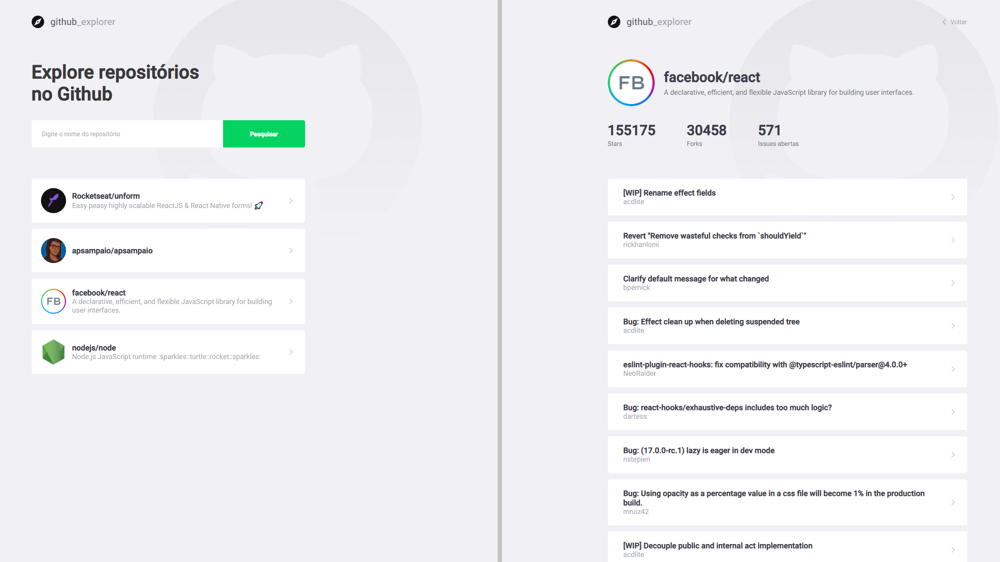

<h1 align="center">
  GoStack 13 Github Explorer
</h1>

  

  

<h1 align="center">
    
</h1>

 

## :rocket: Tecnologias

Esse projeto foi desenvolvido com as seguintes tecnologias:

- [React](https://reactjs.org)
- [TypeScript](https://www.typescriptlang.org/)

Feito com ♥ by Andre Sampaio :wave:
